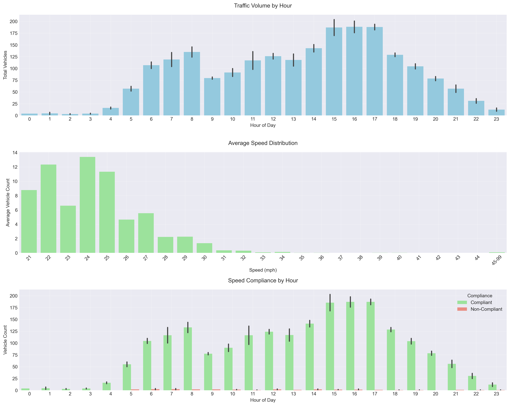

# Traffic Studies

This repository contains code for analyzing traffic data. You can find the example data in the `data` directory.

## 🚀 Getting Started

### Prerequisites

- Python 3.8 or higher
- pip (Python package installer)

### Usage

1. Clone the repository:

```bash
git clone https://github.com/yourusername/traffic-studies.git
cd traffic-studies
```

2. Create a virtual environment (optional but recommended):

```bash
python -m venv venv
source venv/bin/activate  # On Windows, use: venv\Scripts\activate
```

3. Install required packages:
```bash
pip install -r requirements.txt
```

4. Run the traffic analysis script:
```bash
python traffic_analysis.py
```

## Output

|  |
| :-----------------------------------------: |

## 📜 License

The code in this repository is available under the [MIT License](LICENSE).
